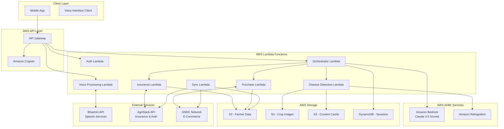
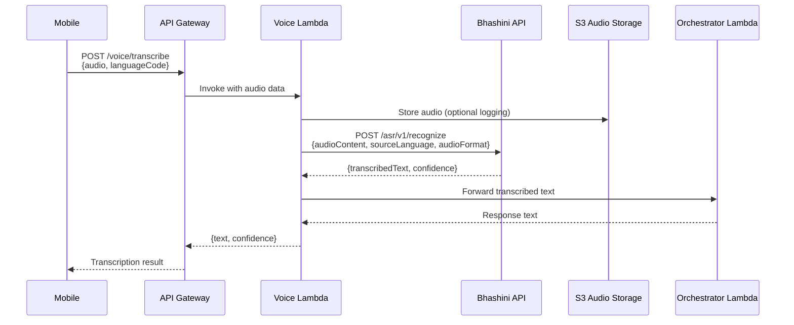
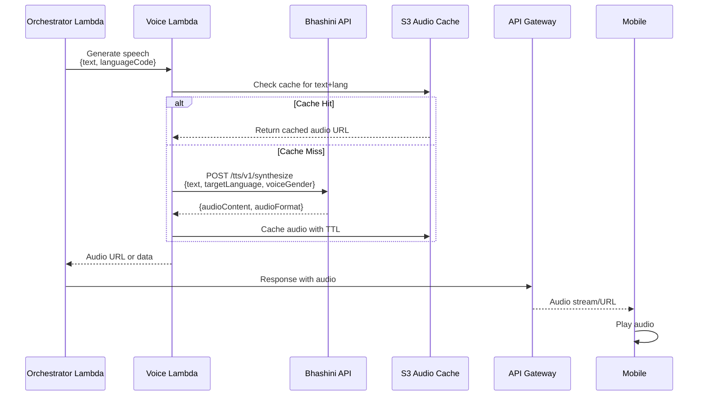
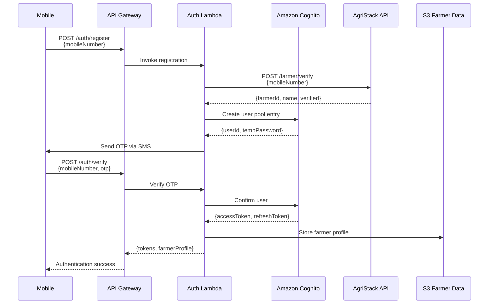
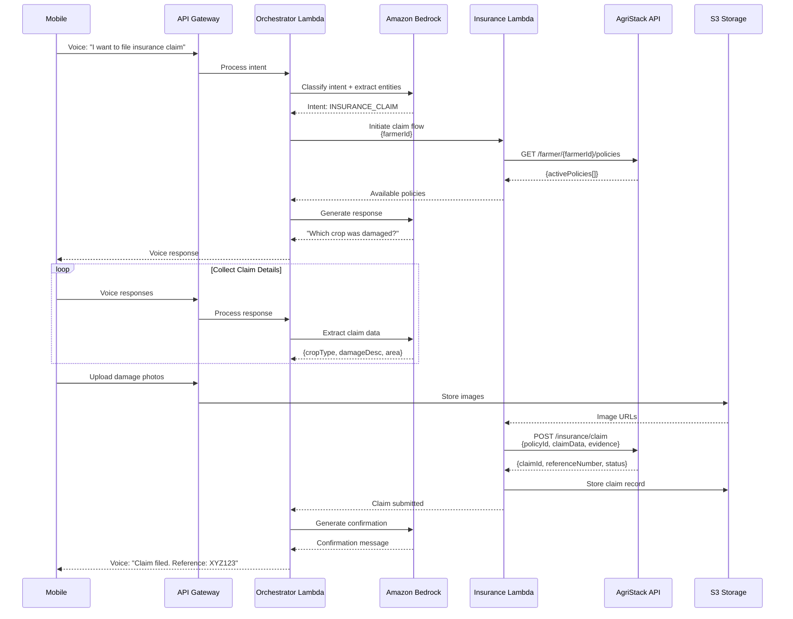
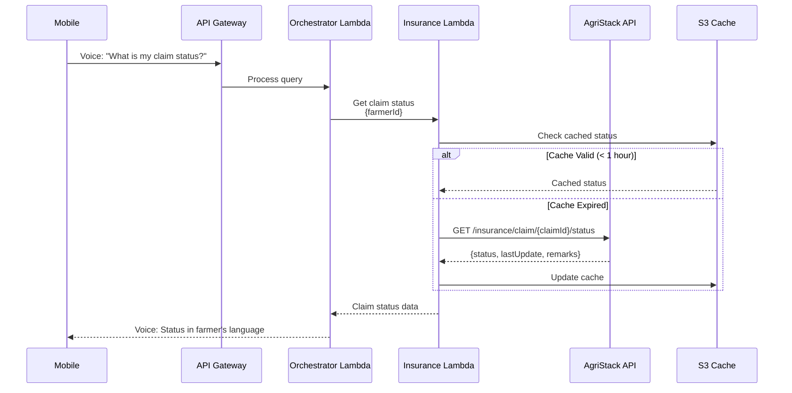

# Design Document: Agri-Sarthi

## Overview

Agri-Sarthi is a voice-first autonomous AI agent designed to bridge the digital divide for Indian farmers. The system architecture prioritizes simplicity, reliability, and accessibility for users with low digital literacy. The design follows a modular approach with clear separation between the voice interface layer, business logic layer, and external service integration layer.

The system operates primarily through voice interactions in 22 Indian regional languages, with minimal visual UI elements. Core workflows include crop disease diagnosis through image analysis, insurance claim filing, and agricultural product purchasing. All interactions are designed to be conversational and forgiving of user errors.

## Architecture

### High-Level Architecture (AWS Serverless)



### AWS Serverless Architecture Details

**API Gateway:**
- RESTful API endpoints for all client interactions
- WebSocket API for real-time voice streaming
- Request validation and throttling
- CORS configuration for mobile app
- API key management for external service access

**Amazon Cognito:**
- User authentication via mobile number (OTP)
- User pool for farmer accounts
- Identity pool for temporary AWS credentials
- MFA support for sensitive operations
- Integration with AgriStack for farmer verification

**AWS Lambda Functions:**
- **Auth Lambda**: Handles authentication, token generation, farmer registration
- **Voice Lambda**: Processes voice input/output, interfaces with Bhashini
- **Orchestrator Lambda**: Main conversation logic powered by Bedrock, routes to specialized services
- **Disease Lambda**: Manages crop image analysis via Rekognition
- **Insurance Lambda**: Handles AgriStack integration for claims
- **Purchase Lambda**: Manages ONDC integration for product search and orders
- **Sync Lambda**: Background job for syncing offline actions (triggered by EventBridge)

**Amazon Bedrock (Claude 3.5 Sonnet):**
- Conversational AI brain for understanding farmer intent
- Context-aware dialogue management
- Multilingual conversation handling (post-translation)
- Dynamic response generation
- Intent classification and entity extraction
- Conversation flow orchestration

**Amazon S3:**
- **Farmer Data Bucket**: Encrypted storage for farmer profiles, preferences, consent records
- **Crop Images Bucket**: Temporary storage for uploaded crop images (lifecycle policy: 30 days)
- **Content Cache Bucket**: Disease information, treatment guides, product catalogs for offline access
- Server-side encryption (SSE-S3 or SSE-KMS)
- Versioning enabled for data buckets
- Lifecycle policies for cost optimization

**Amazon DynamoDB:**
- **Sessions Table**: Active conversation sessions with TTL
- **Conversation History Table**: Message history for context
- **Pending Actions Table**: Queued actions for offline sync
- **Cache Metadata Table**: Tracks cached content freshness
- On-demand billing for variable workload
- Point-in-time recovery enabled

**Amazon Rekognition:**
- Custom Labels model trained on Indian crop diseases
- Label detection for disease identification
- Confidence scoring for diagnosis accuracy
- Image quality assessment

### Design Principles

1. **Voice-First**: All primary interactions happen through voice; visual elements are supplementary
2. **Serverless-First**: No server management, auto-scaling, pay-per-use
3. **AI-Powered**: Bedrock Claude 3.5 Sonnet provides intelligent conversation handling
4. **Fault Tolerance**: Graceful degradation when services are unavailable
5. **Offline-Capable**: S3-based content cache for offline access
6. **Stateful Conversations**: DynamoDB maintains context across interactions
7. **Security by Default**: Cognito auth, S3 encryption, VPC endpoints for private communication
8. **Cost-Optimized**: Serverless architecture with lifecycle policies and caching

## API Flow Details

### Bhashini API Integration Flow

**Speech-to-Text (STT) Flow:**



**Text-to-Speech (TTS) Flow:**



**Bhashini API Endpoints:**

```typescript
// Bhashini Configuration
const BHASHINI_CONFIG = {
  baseURL: 'https://dhruva-api.bhashini.gov.in/services',
  apiKey: process.env.BHASHINI_API_KEY,
  userId: process.env.BHASHINI_USER_ID,
  timeout: 10000
};

// STT Request
interface BhashiniSTTRequest {
  config: {
    serviceId: string;           // ASR service ID
    language: {
      sourceLanguage: string;    // ISO 639-1 code (e.g., 'hi', 'ta', 'te')
    };
    audioFormat: string;         // 'wav', 'mp3', 'flac'
    samplingRate: number;        // 16000 or 8000
  };
  audio: [{
    audioContent: string;        // Base64 encoded audio
  }];
}

// STT Response
interface BhashiniSTTResponse {
  output: [{
    source: string;              // Transcribed text
  }];
  config: {
    language: {
      sourceLanguage: string;
    };
  };
}

// TTS Request
interface BhashiniTTSRequest {
  config: {
    serviceId: string;           // TTS service ID
    language: {
      sourceLanguage: string;    // ISO 639-1 code
    };
    gender: 'male' | 'female';
  };
  input: [{
    source: string;              // Text to synthesize
  }];
}

// TTS Response
interface BhashiniTTSResponse {
  audio: [{
    audioContent: string;        // Base64 encoded audio
  }];
  config: {
    language: {
      sourceLanguage: string;
    };
  };
}

// Supported Languages (22 Indian Languages)
const SUPPORTED_LANGUAGES = [
  'hi',  // Hindi
  'bn',  // Bengali
  'te',  // Telugu
  'mr',  // Marathi
  'ta',  // Tamil
  'gu',  // Gujarati
  'kn',  // Kannada
  'ml',  // Malayalam
  'pa',  // Punjabi
  'or',  // Odia
  'as',  // Assamese
  'mai', // Maithili
  'sa',  // Sanskrit
  'ks',  // Kashmiri
  'ne',  // Nepali
  'sd',  // Sindhi
  'kok', // Konkani
  'doi', // Dogri
  'mni', // Manipuri
  'sat', // Santali
  'ur',  // Urdu
  'en'   // English
];
```

### AgriStack API Integration Flow

**Farmer Authentication Flow:**



**Insurance Claim Filing Flow:**



**Claim Status Check Flow:**



**AgriStack API Endpoints:**

```typescript
// AgriStack Configuration
const AGRISTACK_CONFIG = {
  baseURL: 'https://api.agristack.gov.in/v1',
  apiKey: process.env.AGRISTACK_API_KEY,
  clientId: process.env.AGRISTACK_CLIENT_ID,
  clientSecret: process.env.AGRISTACK_CLIENT_SECRET,
  timeout: 15000
};

// Farmer Verification Request
interface AgriStackFarmerVerifyRequest {
  mobileNumber: string;
  consent: boolean;              // DPDP Act compliance
  purpose: string;               // Reason for data access
}

// Farmer Verification Response
interface AgriStackFarmerVerifyResponse {
  farmerId: string;              // Unique farmer ID
  name: string;
  mobileNumber: string;
  verified: boolean;
  kycStatus: 'verified' | 'pending' | 'rejected';
  landHoldings: [{
    surveyNumber: string;
    area: number;                // In hectares
    location: {
      state: string;
      district: string;
      village: string;
    };
  }];
}

// Get Farmer Policies Request
interface AgriStackPoliciesRequest {
  farmerId: string;
  status?: 'active' | 'expired' | 'all';
}

// Get Farmer Policies Response
interface AgriStackPoliciesResponse {
  policies: [{
    policyId: string;
    policyNumber: string;
    insuranceCompany: string;
    cropType: string;
    sumInsured: number;
    premium: number;
    startDate: string;           // ISO 8601
    endDate: string;
    status: 'active' | 'expired' | 'claimed';
  }];
}

// Submit Insurance Claim Request
interface AgriStackClaimRequest {
  farmerId: string;
  policyId: string;
  claimDetails: {
    cropType: string;
    damageType: string;          // 'drought', 'flood', 'pest', 'disease'
    damageDate: string;          // ISO 8601
    affectedArea: number;        // In hectares
    estimatedLoss: number;       // In INR
    description: string;
  };
  evidence: [{
    type: 'photo' | 'document';
    url: string;                 // S3 presigned URL
    description: string;
  }];
  geoLocation?: {
    latitude: number;
    longitude: number;
  };
}

// Submit Insurance Claim Response
interface AgriStackClaimResponse {
  claimId: string;
  claimReferenceNumber: string;
  status: 'submitted' | 'under_review' | 'approved' | 'rejected';
  submissionDate: string;        // ISO 8601
  estimatedProcessingDays: number;
  nextSteps: string[];
}

// Get Claim Status Request
interface AgriStackClaimStatusRequest {
  claimId: string;
  farmerId: string;
}

// Get Claim Status Response
interface AgriStackClaimStatusResponse {
  claimId: string;
  claimReferenceNumber: string;
  status: 'submitted' | 'under_review' | 'field_inspection_scheduled' | 
          'approved' | 'rejected' | 'payment_processed';
  lastUpdated: string;           // ISO 8601
  remarks: string;
  approvedAmount?: number;       // If approved
  paymentDate?: string;          // If payment processed
  rejectionReason?: string;      // If rejected
  timeline: [{
    stage: string;
    date: string;
    remarks: string;
  }];
}

// Authentication (OAuth 2.0)
interface AgriStackAuthRequest {
  grant_type: 'client_credentials';
  client_id: string;
  client_secret: string;
  scope: string;                 // 'farmer:read farmer:write insurance:write'
}

interface AgriStackAuthResponse {
  access_token: string;
  token_type: 'Bearer';
  expires_in: number;            // Seconds
  scope: string;
}
```

## Components and Interfaces

### 1. Voice Interface Component (Voice Lambda)

**Responsibilities:**
- Capture audio input from farmers
- Convert speech to text using Bhashini
- Convert system responses to speech
- Handle language selection and switching
- Provide audio feedback during processing

**Key Interfaces:**

```typescript
interface VoiceInterface {
  // Initialize with language preference
  initialize(languageCode: string): Promise<void>
  
  // Capture and transcribe voice input
  captureVoiceInput(): Promise<VoiceInput>
  
  // Convert text to speech and play
  speakResponse(text: string, languageCode: string): Promise<void>
  
  // Provide audio feedback (listening, processing, etc.)
  playFeedback(feedbackType: FeedbackType): void
  
  // Change language mid-conversation
  switchLanguage(newLanguageCode: string): Promise<void>
}

interface VoiceInput {
  transcribedText: string
  languageCode: string
  confidence: number
  audioData?: Blob
}

enum FeedbackType {
  LISTENING,
  PROCESSING,
  ERROR,
  SUCCESS
}
```

### 2. Conversation Orchestrator (Orchestrator Lambda + Bedrock)

**Responsibilities:**
- Manage conversation state and context using DynamoDB
- Use Amazon Bedrock (Claude 3.5 Sonnet) for intent classification and response generation
- Route requests to appropriate specialized Lambda functions
- Handle multi-turn conversations with context awareness
- Implement conversation flow logic
- Manage error recovery and clarification
- Coordinate with Voice Lambda for speech I/O

**Key Interfaces:**

```typescript
interface ConversationOrchestrator {
  // Process user input and generate response using Bedrock
  processInput(input: VoiceInput, sessionId: string): Promise<ConversationResponse>
  
  // Get current conversation context from DynamoDB
  getContext(sessionId: string): Promise<ConversationContext>
  
  // Reset conversation state
  resetConversation(sessionId: string): Promise<void>
  
  // Call Bedrock for intent classification
  classifyIntent(text: string, context: ConversationContext): Promise<Intent>
  
  // Call Bedrock for response generation
  generateResponse(intent: Intent, context: ConversationContext, data: any): Promise<string>
}

interface ConversationContext {
  sessionId: string
  farmerId: string
  languageCode: string
  currentIntent: Intent
  conversationHistory: Message[]
  pendingActions: Action[]
  bedrockContext: BedrockContext    // Bedrock-specific context
}

interface BedrockContext {
  conversationId: string
  systemPrompt: string              // Language-specific system prompt
  previousMessages: BedrockMessage[]
  maxTokens: number
  temperature: number
}

interface BedrockMessage {
  role: 'user' | 'assistant'
  content: string
  timestamp: Date
}

interface ConversationResponse {
  responseText: string
  requiresFollowUp: boolean
  suggestedActions?: string[]
  visualData?: any
  confidence: number                // Bedrock confidence score
}

enum Intent {
  DISEASE_DETECTION,
  INSURANCE_CLAIM,
  PRODUCT_PURCHASE,
  ORDER_STATUS,
  CLAIM_STATUS,
  HELP,
  LANGUAGE_CHANGE,
  UNCLEAR                          // When Bedrock can't determine intent
}

// Bedrock Integration
interface BedrockService {
  // Invoke Claude 3.5 Sonnet for conversation
  invokeModel(request: BedrockInvokeRequest): Promise<BedrockInvokeResponse>
}

interface BedrockInvokeRequest {
  modelId: 'anthropic.claude-3-5-sonnet-20241022-v2:0'
  body: {
    anthropic_version: 'bedrock-2023-05-31'
    max_tokens: number
    temperature: number
    system: string                  // System prompt with farmer context
    messages: BedrockMessage[]
  }
}

interface BedrockInvokeResponse {
  content: [{
    type: 'text'
    text: string
  }]
  stop_reason: 'end_turn' | 'max_tokens' | 'stop_sequence'
  usage: {
    input_tokens: number
    output_tokens: number
  }
}

// System Prompt Template for Bedrock
const SYSTEM_PROMPT_TEMPLATE = `
You are Agri-Sarthi, a helpful AI assistant for Indian farmers. You are speaking with a farmer in {language}.

Context:
- Farmer ID: {farmerId}
- Language: {language}
- Current conversation: {conversationSummary}

Your capabilities:
1. Diagnose crop diseases from images
2. Help file insurance claims
3. Help purchase agricultural products
4. Check order and claim status

Guidelines:
- Use simple, conversational language appropriate for farmers
- Be patient and ask clarifying questions
- Provide specific, actionable advice
- Always confirm important actions before proceeding
- If unsure, ask for clarification rather than guessing

Current task: {currentIntent}
`;
```

### 3. Disease Detection Service (Disease Lambda)

**Responsibilities:**
- Accept crop images from farmers via API Gateway
- Store images in S3 with lifecycle policies
- Validate image quality before analysis
- Call Amazon Rekognition Custom Labels for disease detection
- Map detection results to disease information
- Provide treatment recommendations
- Cache disease information in S3 for offline access
- Generate presigned URLs for image access

**Key Interfaces:**

```typescript
interface DiseaseDetectionService {
  // Analyze crop image for diseases using Rekognition
  analyzeImage(image: ImageData, cropType: string): Promise<DiseaseAnalysis>
  
  // Validate image quality before analysis
  validateImageQuality(image: ImageData): Promise<ValidationResult>
  
  // Get treatment recommendations for detected disease
  getTreatmentRecommendations(diseaseId: string, languageCode: string): Promise<Treatment[]>
  
  // Get cached disease information from S3 (offline mode)
  getCachedDiseaseInfo(diseaseId: string): Promise<DiseaseInfo | null>
  
  // Store image in S3 and return presigned URL
  storeImage(image: ImageData, farmerId: string): Promise<string>
}

interface ImageData {
  imageBlob: Blob
  captureTimestamp: Date
  location?: GeoLocation
  cropType?: string
  s3Key?: string                    // S3 object key after upload
  presignedUrl?: string             // For temporary access
}

interface DiseaseAnalysis {
  diseaseDetected: boolean
  diseaseName?: string
  confidence: number
  severity: Severity
  affectedArea?: string
  recommendations: Treatment[]
  rekognitionLabels: RekognitionLabel[]  // Raw Rekognition output
  imageS3Url: string                     // S3 location of analyzed image
}

interface RekognitionLabel {
  name: string
  confidence: number
  instances?: {
    boundingBox: {
      width: number
      height: number
      left: number
      top: number
    }
  }[]
}

interface Treatment {
  treatmentName: string
  description: string
  products?: ProductReference[]
  applicationMethod: string
  precautions: string[]
  estimatedCost?: number            // In INR
}

enum Severity {
  LOW,
  MEDIUM,
  HIGH,
  CRITICAL
}

// S3 Storage Configuration
const S3_CONFIG = {
  imageBucket: process.env.CROP_IMAGES_BUCKET,
  cacheBucket: process.env.CONTENT_CACHE_BUCKET,
  imagePrefix: 'crop-images/',
  cachePrefix: 'disease-info/',
  imageLifecycleDays: 30,           // Auto-delete after 30 days
  presignedUrlExpiry: 3600          // 1 hour
};

// Rekognition Custom Labels Configuration
const REKOGNITION_CONFIG = {
  projectVersionArn: process.env.REKOGNITION_PROJECT_ARN,
  minConfidence: 70,                // Minimum confidence threshold
  maxLabels: 10
};
```

### 4. Insurance Service (Insurance Lambda)

**Responsibilities:**
- Authenticate farmers via AgriStack API
- Collect claim information through Bedrock-powered conversation
- Submit claims to insurance providers via AgriStack
- Track claim status with S3 caching
- Guide farmers through documentation requirements
- Store claim records in S3 with encryption

**Key Interfaces:**

```typescript
interface InsuranceService {
  // Retrieve farmer details from AgriStack
  getFarmerDetails(farmerId: string): Promise<FarmerProfile>
  
  // Create new insurance claim via AgriStack
  createClaim(claimData: ClaimData): Promise<ClaimResult>
  
  // Get claim status (with S3 caching)
  getClaimStatus(claimId: string, useCache?: boolean): Promise<ClaimStatus>
  
  // Upload supporting documentation to S3 and link to claim
  uploadClaimEvidence(claimId: string, evidence: Evidence[]): Promise<string[]>
  
  // Cache claim data in S3
  cacheClaimData(claimId: string, data: any): Promise<void>
}

interface FarmerProfile {
  farmerId: string
  name: string
  mobileNumber: string
  landHoldings: LandHolding[]
  activeInsurancePolicies: InsurancePolicy[]
  kycStatus: 'verified' | 'pending' | 'rejected'
  s3ProfileKey: string              // S3 location of full profile
}

interface ClaimData {
  farmerId: string
  policyId: string
  cropType: string
  damageType: string
  damageDescription: string
  affectedArea: number
  damageDate: Date
  estimatedLoss: number
  evidenceUrls: string[]            // S3 presigned URLs
  geoLocation?: {
    latitude: number
    longitude: number
  }
}

interface ClaimResult {
  claimId: string
  claimReferenceNumber: string
  status: ClaimStatus
  submissionDate: Date
  estimatedProcessingDays: number
  s3ClaimKey: string                // S3 location of claim record
}

interface Evidence {
  type: 'photo' | 'document'
  data: Buffer | Blob
  description: string
  captureDate: Date
}

enum ClaimStatus {
  SUBMITTED,
  UNDER_REVIEW,
  FIELD_INSPECTION_SCHEDULED,
  APPROVED,
  REJECTED,
  PAYMENT_PROCESSED
}

// S3 Storage for Claims
const CLAIMS_S3_CONFIG = {
  bucket: process.env.FARMER_DATA_BUCKET,
  claimsPrefix: 'insurance-claims/',
  evidencePrefix: 'claim-evidence/',
  cachePrefix: 'claim-status-cache/',
  cacheTTL: 3600                    // 1 hour cache for status
};
```

### 5. Purchase Service (Purchase Lambda)

**Responsibilities:**
- Search ONDC network for agricultural products
- Present product options via Bedrock-generated voice responses
- Manage shopping cart in DynamoDB
- Process orders through ONDC
- Track order status with S3 caching
- Store order history in S3

**Key Interfaces:**

```typescript
interface PurchaseService {
  // Search for products on ONDC
  searchProducts(query: string, filters?: ProductFilters): Promise<Product[]>
  
  // Get product details from ONDC
  getProductDetails(productId: string): Promise<ProductDetails>
  
  // Add product to cart (stored in DynamoDB)
  addToCart(sessionId: string, productId: string, quantity: number): Promise<Cart>
  
  // Place order via ONDC
  placeOrder(sessionId: string, deliveryAddress: Address, paymentMethod: PaymentMethod): Promise<OrderResult>
  
  // Get order status (with S3 caching)
  getOrderStatus(orderId: string, useCache?: boolean): Promise<OrderStatus>
  
  // Cache product catalog in S3 for offline access
  cacheProductCatalog(products: Product[]): Promise<void>
}

interface Product {
  productId: string
  name: string
  description: string
  price: number
  sellerId: string
  sellerName: string
  availability: boolean
  rating?: number
  imageUrl?: string
  category: string
  s3CacheKey?: string               // S3 location if cached
}

interface Cart {
  sessionId: string
  items: CartItem[]
  totalAmount: number
  lastUpdated: Date
}

interface CartItem {
  productId: string
  productName: string
  quantity: number
  unitPrice: number
  totalPrice: number
}

interface OrderResult {
  orderId: string
  orderNumber: string
  estimatedDelivery: Date
  totalAmount: number
  status: OrderStatus
  s3OrderKey: string                // S3 location of order record
}

enum OrderStatus {
  PENDING,
  CONFIRMED,
  SHIPPED,
  OUT_FOR_DELIVERY,
  DELIVERED,
  CANCELLED
}

// DynamoDB Table for Shopping Carts
const CART_TABLE_CONFIG = {
  tableName: process.env.CART_TABLE_NAME,
  ttl: 86400                        // 24 hours
};

// S3 Storage for Orders
const ORDERS_S3_CONFIG = {
  bucket: process.env.FARMER_DATA_BUCKET,
  ordersPrefix: 'orders/',
  statusCachePrefix: 'order-status-cache/',
  productCachePrefix: 'product-catalog/',
  cacheTTL: 3600                    // 1 hour cache for status
};
```

### 6. Content Cache Service (S3-based)

**Responsibilities:**
- Cache frequently accessed content in S3 for offline use
- Manage cache invalidation and updates via S3 lifecycle policies
- Provide fallback content when external services unavailable
- Store educational content and tutorials
- Sync pending actions when connectivity restored (via Sync Lambda)

**Key Interfaces:**

```typescript
interface ContentCacheService {
  // Cache disease information in S3
  cacheDiseaseInfo(diseaseId: string, info: DiseaseInfo): Promise<void>
  
  // Cache product information in S3
  cacheProductInfo(productId: string, info: ProductDetails): Promise<void>
  
  // Retrieve cached content from S3
  getCachedContent(contentType: ContentType, contentId: string): Promise<any | null>
  
  // Check if content is available offline (exists in S3)
  isAvailableOffline(contentType: ContentType, contentId: string): Promise<boolean>
  
  // Queue pending action in DynamoDB for later sync
  queuePendingAction(action: Action): Promise<void>
  
  // Sync pending actions (called by Sync Lambda)
  syncPendingActions(farmerId: string): Promise<SyncResult>
  
  // Generate presigned URL for cached content
  getPresignedUrl(s3Key: string, expirySeconds: number): Promise<string>
}

enum ContentType {
  DISEASE_INFO,
  PRODUCT_INFO,
  EDUCATIONAL_CONTENT,
  TUTORIAL,
  TREATMENT_GUIDE
}

interface SyncResult {
  totalActions: number
  successfulSyncs: number
  failedSyncs: number
  errors: SyncError[]
}

interface SyncError {
  actionId: string
  actionType: ActionType
  error: string
  retryable: boolean
}

// S3 Cache Configuration
const CACHE_S3_CONFIG = {
  bucket: process.env.CONTENT_CACHE_BUCKET,
  diseaseInfoPrefix: 'disease-info/',
  productInfoPrefix: 'product-info/',
  educationalPrefix: 'educational/',
  tutorialPrefix: 'tutorials/',
  defaultTTL: 604800,               // 7 days
  presignedUrlExpiry: 3600          // 1 hour
};

// DynamoDB Table for Pending Actions
const PENDING_ACTIONS_TABLE = {
  tableName: process.env.PENDING_ACTIONS_TABLE,
  gsi: 'farmerId-status-index',    // For querying by farmer and status
  ttl: 2592000                      // 30 days
};

// EventBridge Rule for Sync Lambda
const SYNC_SCHEDULE = {
  ruleName: 'agri-sarthi-sync-rule',
  schedule: 'rate(5 minutes)',      // Run every 5 minutes
  targetLambda: process.env.SYNC_LAMBDA_ARN
};
```

## Data Models

### DynamoDB Tables

**Sessions Table:**
```typescript
interface SessionRecord {
  sessionId: string;                // Partition Key
  farmerId: string;                 // GSI Partition Key
  startTime: number;                // Unix timestamp
  lastActivityTime: number;         // Unix timestamp, TTL attribute
  languageCode: string;
  deviceInfo: DeviceInfo;
  ttl: number;                      // Auto-delete after 24 hours
}

// Table Configuration
const SESSIONS_TABLE = {
  tableName: 'agri-sarthi-sessions',
  partitionKey: 'sessionId',
  gsi: {
    name: 'farmerId-index',
    partitionKey: 'farmerId'
  },
  ttl: {
    enabled: true,
    attribute: 'ttl'
  }
};
```

**Conversation History Table:**
```typescript
interface ConversationRecord {
  sessionId: string;                // Partition Key
  messageId: string;                // Sort Key (timestamp-based)
  timestamp: number;                // Unix timestamp
  sender: 'farmer' | 'system';
  content: string;
  intent?: string;
  metadata?: Record<string, any>;
  ttl: number;                      // Auto-delete after 30 days
}

// Table Configuration
const CONVERSATION_TABLE = {
  tableName: 'agri-sarthi-conversations',
  partitionKey: 'sessionId',
  sortKey: 'messageId',
  ttl: {
    enabled: true,
    attribute: 'ttl'
  }
};
```

**Pending Actions Table:**
```typescript
interface PendingActionRecord {
  actionId: string;                 // Partition Key (UUID)
  farmerId: string;                 // GSI Partition Key
  status: 'pending' | 'completed' | 'failed';  // GSI Sort Key
  actionType: ActionType;
  payload: any;                     // JSON payload
  createdAt: number;                // Unix timestamp
  lastAttempt?: number;             // Unix timestamp
  retryCount: number;
  maxRetries: number;
  error?: string;
  ttl: number;                      // Auto-delete after 30 days
}

enum ActionType {
  SUBMIT_CLAIM = 'SUBMIT_CLAIM',
  PLACE_ORDER = 'PLACE_ORDER',
  ANALYZE_IMAGE = 'ANALYZE_IMAGE',
  SYNC_DATA = 'SYNC_DATA'
}

// Table Configuration
const PENDING_ACTIONS_TABLE = {
  tableName: 'agri-sarthi-pending-actions',
  partitionKey: 'actionId',
  gsi: {
    name: 'farmerId-status-index',
    partitionKey: 'farmerId',
    sortKey: 'status'
  },
  ttl: {
    enabled: true,
    attribute: 'ttl'
  }
};
```

**Shopping Carts Table:**
```typescript
interface CartRecord {
  sessionId: string;                // Partition Key
  farmerId: string;
  items: CartItem[];
  totalAmount: number;
  currency: 'INR';
  lastUpdated: number;              // Unix timestamp
  ttl: number;                      // Auto-delete after 24 hours
}

// Table Configuration
const CARTS_TABLE = {
  tableName: 'agri-sarthi-carts',
  partitionKey: 'sessionId',
  ttl: {
    enabled: true,
    attribute: 'ttl'
  }
};
```

### S3 Data Structure

**Farmer Data Bucket:**
```
s3://agri-sarthi-farmer-data/
├── profiles/
│   └── {farmerId}/
│       ├── profile.json
│       ├── consent-records.json
│       └── preferences.json
├── insurance-claims/
│   └── {farmerId}/
│       └── {claimId}/
│           ├── claim-data.json
│           ├── evidence/
│           │   ├── photo1.jpg
│           │   └── photo2.jpg
│           └── status-history.json
└── orders/
    └── {farmerId}/
        └── {orderId}/
            ├── order-data.json
            └── invoice.pdf
```

**Crop Images Bucket:**
```
s3://agri-sarthi-crop-images/
└── {farmerId}/
    └── {year}/{month}/{day}/
        └── {imageId}.jpg
        
# Lifecycle Policy: Delete after 30 days
```

**Content Cache Bucket:**
```
s3://agri-sarthi-content-cache/
├── disease-info/
│   └── {diseaseId}/
│       ├── info-{lang}.json
│       └── images/
├── product-info/
│   └── {productId}/
│       └── details-{lang}.json
├── educational/
│   └── {contentId}/
│       └── content-{lang}.json
└── tutorials/
    └── {tutorialId}/
        ├── script-{lang}.json
        └── audio-{lang}.mp3
```

### Core Data Structures

```typescript
// Farmer entity (stored in S3)
interface Farmer {
  id: string;
  mobileNumber: string;
  preferredLanguage: string;
  registrationDate: Date;
  lastActiveDate: Date;
  consentGiven: boolean;
  consentTimestamp: Date;
  kycStatus: 'verified' | 'pending' | 'rejected';
  agriStackId?: string;
  s3ProfileKey: string;
}

// Session entity (stored in DynamoDB)
interface Session {
  sessionId: string;
  farmerId: string;
  startTime: Date;
  lastActivityTime: Date;
  languageCode: string;
  deviceInfo: DeviceInfo;
}

interface DeviceInfo {
  deviceId: string;
  platform: 'android' | 'ios' | 'web';
  appVersion: string;
  osVersion: string;
}

// Message entity (stored in DynamoDB)
interface Message {
  messageId: string;
  sessionId: string;
  timestamp: Date;
  sender: 'farmer' | 'system';
  content: string;
  intent?: Intent;
  metadata?: Record<string, any>;
}

// Action entity (stored in DynamoDB for offline queue)
interface Action {
  actionId: string;
  farmerId: string;
  actionType: ActionType;
  payload: any;
  createdAt: Date;
  status: 'pending' | 'completed' | 'failed';
  retryCount: number;
  maxRetries: number;
  lastAttempt?: Date;
  error?: string;
}
```

### External Service Models

```typescript
// Bhashini request/response
interface BhashiniSTTRequest {
  audioContent: string // base64 encoded
  sourceLanguage: string
  audioFormat: string
}

interface BhashiniSTTResponse {
  transcribedText: string
  confidence: number
  languageDetected: string
}

interface BhashiniTTSRequest {
  text: string
  targetLanguage: string
  voiceGender?: 'male' | 'female'
}

interface BhashiniTTSResponse {
  audioContent: string // base64 encoded
  audioFormat: string
}

// Rekognition request/response
interface RekognitionRequest {
  image: {
    bytes: Buffer
  }
  features: string[]
}

interface RekognitionResponse {
  labels: Label[]
  customLabels?: CustomLabel[]
}

// AgriStack request/response
interface AgriStackFarmerRequest {
  farmerId: string
  authToken: string
}

interface AgriStackClaimRequest {
  farmerId: string
  policyNumber: string
  claimDetails: ClaimData
  supportingDocuments: Document[]
}

// ONDC request/response
interface ONDCSearchRequest {
  context: ONDCContext
  message: {
    intent: {
      item: {
        descriptor: {
          name: string
        }
      }
      category: {
        id: string
      }
    }
  }
}

interface ONDCOrderRequest {
  context: ONDCContext
  message: {
    order: {
      items: OrderItem[]
      billing: BillingInfo
      fulfillment: FulfillmentInfo
    }
  }
}
```

## Correctness Properties

*A property is a characteristic or behavior that should hold true across all valid executions of a system—essentially, a formal statement about what the system should do. Properties serve as the bridge between human-readable specifications and machine-verifiable correctness guarantees.*


### Property 1: Multilingual Voice Support

*For any* supported language code (among the 22 Indian regional languages), when text is provided for speech synthesis, the Voice Interface should successfully convert it to audio in that language.

**Validates: Requirements 1.1, 1.3, 8.1**

### Property 2: Voice Processing Feedback

*For any* voice input processing operation, the system should provide audio feedback to indicate processing status (listening, processing, error, or success).

**Validates: Requirements 1.5**

### Property 3: Image Acceptance

*For any* valid image data (within size and format constraints), the Disease Detector should accept the image for analysis.

**Validates: Requirements 2.1**

### Property 4: Disease Analysis Response Completeness

*For any* disease detection result where a disease is identified, the response should contain disease name, severity level, and treatment recommendations in the requested language.

**Validates: Requirements 2.3**

### Property 5: Product Suggestion After Disease Detection

*For any* disease detection result, the system should offer to connect the farmer with relevant treatment products.

**Validates: Requirements 2.6**

### Property 6: Farmer Data Retrieval for Claims

*For any* valid farmer ID, when initiating an insurance claim, the system should retrieve farmer details from AgriStack.

**Validates: Requirements 3.1**

### Property 7: Complete Claim Data Collection

*For any* insurance claim submission, all required fields (crop type, damage description, affected area) should be collected before submission is allowed.

**Validates: Requirements 3.2**

### Property 8: Claim Submission Confirmation

*For any* successful claim submission, the system should return a unique claim reference number to the farmer.

**Validates: Requirements 3.4**

### Property 9: Status Retrieval with Translation

*For any* valid claim ID or order ID and any supported language code, the system should retrieve the current status and present it in the requested language.

**Validates: Requirements 3.5, 4.6**

### Property 10: Product Search Execution

*For any* product search query, the Purchase Handler should call the ONDC service and return matching products.

**Validates: Requirements 4.1**

### Property 11: Product Information Completeness

*For any* product in search results, the voice presentation should include product name, price, and seller information.

**Validates: Requirements 4.2**

### Property 12: Cart Update Confirmation

*For any* product selection, the shopping cart should be updated and voice confirmation should be provided.

**Validates: Requirements 4.3**

### Property 13: Checkout Data Collection

*For any* order placement, all required checkout information (payment method, delivery address) should be collected before order submission.

**Validates: Requirements 4.4**

### Property 14: Order Confirmation

*For any* successful order placement, the system should return a unique order confirmation number.

**Validates: Requirements 4.5**

### Property 15: Authentication for Sensitive Operations

*For any* sensitive operation (insurance claims, purchases), the system should require authentication before proceeding.

**Validates: Requirements 5.3, 5.5**

### Property 16: Payment Data Non-Persistence

*For any* payment transaction, payment credentials should not be stored in local storage or database.

**Validates: Requirements 5.6**

### Property 17: Offline Mode Notification

*For any* network connectivity loss event, the system should notify the farmer via voice and indicate unavailable features.

**Validates: Requirements 6.1**

### Property 18: Content Caching

*For any* disease information or product information accessed while online, the content should be cached for offline access.

**Validates: Requirements 6.2**

### Property 19: Pending Action Synchronization

*For any* pending actions (queued claims, orders, or image analyses) when connectivity is restored, the system should automatically process them.

**Validates: Requirements 6.3, 6.4**

### Property 20: Offline Content Access

*For any* cached content, when the system is offline, the content should remain accessible to the farmer.

**Validates: Requirements 6.5**

### Property 21: Option Presentation Limits

*For any* presentation of choices to the farmer, the number of options presented at once should not exceed 4 items.

**Validates: Requirements 7.2**

### Property 22: Error Response with Next Steps

*For any* error condition, the system response should include both an explanation and suggested next steps.

**Validates: Requirements 7.3**

### Property 23: External Service Error Handling

*For any* external service failure (Bhashini, Rekognition, AgriStack, ONDC), the system should handle the error gracefully without crashing and inform the farmer.

**Validates: Requirements 8.5**

### Property 24: Retry Logic with Backoff

*For any* transient external service failure, the system should retry the request with exponentially increasing delays between attempts.

**Validates: Requirements 8.6**

### Property 25: API Interaction Logging

*For any* external service API call, the system should create a log entry with request and response details.

**Validates: Requirements 8.7**

### Property 26: Progress Indicators for Long Operations

*For any* operation taking longer than 2 seconds, the system should provide voice progress indicators to the farmer.

**Validates: Requirements 9.4**

### Property 27: Consent Collection for Data Operations

*For any* data collection operation, the system should obtain and record explicit consent from the farmer.

**Validates: Requirements 10.2**

### Property 28: Data Deletion on Request

*For any* farmer data deletion request, all personal data associated with that farmer should be removed from the system.

**Validates: Requirements 10.3**

### Property 29: Data Sharing Consent Requirement

*For any* attempt to share farmer data with third parties, the system should verify that explicit consent exists before proceeding.

**Validates: Requirements 10.5**

## Error Handling

### Error Categories

1. **Network Errors**: Connectivity loss, timeout, DNS failures
2. **Service Errors**: External API failures, rate limiting, service unavailable
3. **Validation Errors**: Invalid input, missing required fields, format errors
4. **Authentication Errors**: Invalid credentials, expired tokens, unauthorized access
5. **Business Logic Errors**: Insufficient balance, product unavailable, claim already filed

### Error Handling Strategy

**General Principles:**
- All errors should be communicated to farmers in simple, non-technical language
- Every error message should include suggested next steps
- Errors should never expose technical details or stack traces to farmers
- System should log detailed error information for debugging

**Network Error Handling:**
```typescript
interface NetworkErrorHandler {
  // Handle connectivity loss
  onConnectivityLost(): void {
    // 1. Notify farmer via voice
    // 2. Switch to offline mode
    // 3. Queue pending actions
    // 4. Provide offline capabilities
  }
  
  // Handle timeout
  onTimeout(operation: string): void {
    // 1. Inform farmer of delay
    // 2. Offer to retry or cancel
    // 3. Log timeout event
  }
}
```

**Service Error Handling:**
```typescript
interface ServiceErrorHandler {
  // Handle external service failure
  onServiceFailure(service: string, error: Error): void {
    // 1. Log error details
    // 2. Attempt retry with backoff
    // 3. If retries exhausted, inform farmer
    // 4. Suggest alternative actions
  }
  
  // Handle rate limiting
  onRateLimitExceeded(service: string): void {
    // 1. Wait for rate limit reset
    // 2. Inform farmer of temporary delay
    // 3. Queue request for later
  }
}
```

**Validation Error Handling:**
```typescript
interface ValidationErrorHandler {
  // Handle invalid input
  onValidationFailure(field: string, reason: string): void {
    // 1. Explain what's wrong in simple terms
    // 2. Provide example of valid input
    // 3. Ask farmer to try again
  }
  
  // Handle missing required fields
  onMissingFields(fields: string[]): void {
    // 1. List missing information
    // 2. Ask for each field conversationally
    // 3. Confirm when complete
  }
}
```

**Retry Strategy:**
- Maximum 3 retry attempts for transient failures
- Exponential backoff: 1s, 2s, 4s
- Different retry strategies for different error types
- Circuit breaker pattern for repeatedly failing services

**Fallback Mechanisms:**
- Cached data for offline scenarios
- Simplified flows when services unavailable
- Manual fallback options (e.g., call support number)

## Testing Strategy

### Overview

The testing strategy for Agri-Sarthi employs a dual approach combining unit tests and property-based tests to ensure comprehensive coverage and correctness.

**Unit Tests** focus on:
- Specific examples demonstrating correct behavior
- Edge cases and boundary conditions
- Error handling scenarios
- Integration points between components

**Property-Based Tests** focus on:
- Universal properties that hold across all inputs
- Comprehensive input coverage through randomization
- Correctness properties defined in this design document

Both testing approaches are complementary and necessary for ensuring system reliability.

### Property-Based Testing Configuration

**Framework Selection:**
- **JavaScript/TypeScript**: fast-check library
- **Python**: Hypothesis library

**Test Configuration:**
- Minimum 100 iterations per property test (due to randomization)
- Each property test must reference its design document property
- Tag format: `// Feature: agri-sarthi, Property {number}: {property_text}`

**Example Property Test Structure:**
```typescript
import fc from 'fast-check';

// Feature: agri-sarthi, Property 1: Multilingual Voice Support
test('Voice Interface converts text to speech in all supported languages', () => {
  fc.assert(
    fc.property(
      fc.constantFrom(...SUPPORTED_LANGUAGES),
      fc.string({ minLength: 1, maxLength: 500 }),
      async (languageCode, text) => {
        const voiceInterface = new VoiceInterface();
        await voiceInterface.initialize(languageCode);
        
        const result = await voiceInterface.speakResponse(text, languageCode);
        
        expect(result).toBeDefined();
        expect(result.audioData).toBeTruthy();
        expect(result.languageCode).toBe(languageCode);
      }
    ),
    { numRuns: 100 }
  );
});
```

### Unit Testing Strategy

**Component-Level Tests:**
- Test each service component in isolation
- Mock external service dependencies
- Verify correct API calls and parameter passing
- Test error handling and edge cases

**Integration Tests:**
- Test interaction between components
- Verify conversation flows
- Test end-to-end scenarios with mocked external services
- Validate data flow through the system

**Example Unit Test:**
```typescript
describe('DiseaseDetectionService', () => {
  it('should request clearer image when quality is insufficient', async () => {
    const service = new DiseaseDetectionService();
    const lowQualityImage = createLowQualityTestImage();
    
    const validation = await service.validateImageQuality(lowQualityImage);
    
    expect(validation.isValid).toBe(false);
    expect(validation.reason).toContain('quality');
  });
  
  it('should cache disease information after analysis', async () => {
    const service = new DiseaseDetectionService();
    const testImage = createTestImage();
    
    const result = await service.analyzeImage(testImage, 'wheat');
    
    const cached = await service.getCachedDiseaseInfo(result.diseaseId);
    expect(cached).toBeDefined();
    expect(cached.diseaseName).toBe(result.diseaseName);
  });
});
```

### Test Coverage Goals

- **Line Coverage**: Minimum 80%
- **Branch Coverage**: Minimum 75%
- **Property Coverage**: 100% of defined correctness properties
- **Critical Path Coverage**: 100% of user-facing workflows

### Testing External Service Integration

**Mocking Strategy:**
- Create mock implementations of external services
- Use recorded responses for realistic testing
- Test both success and failure scenarios
- Verify correct request formatting

**Contract Testing:**
- Validate request/response formats match API specifications
- Test API version compatibility
- Verify authentication mechanisms
- Test rate limiting and retry logic

### Performance Testing

While not part of unit/property testing, performance requirements should be validated through:
- Load testing with multiple concurrent users
- Latency measurement for critical operations
- Network condition simulation (slow, intermittent)
- Resource usage monitoring (memory, CPU)

### Accessibility Testing

- Voice interface testing with actual speech samples
- Language accuracy verification with native speakers
- Usability testing with target user demographic
- Visual element testing for clarity and readability

### Security Testing

- Authentication and authorization testing
- Data encryption verification
- API security testing
- Privacy compliance validation
- Penetration testing for vulnerabilities

### Continuous Integration

- Automated test execution on every commit
- Property tests run in CI pipeline
- Test failure notifications
- Coverage reporting
- Performance regression detection
